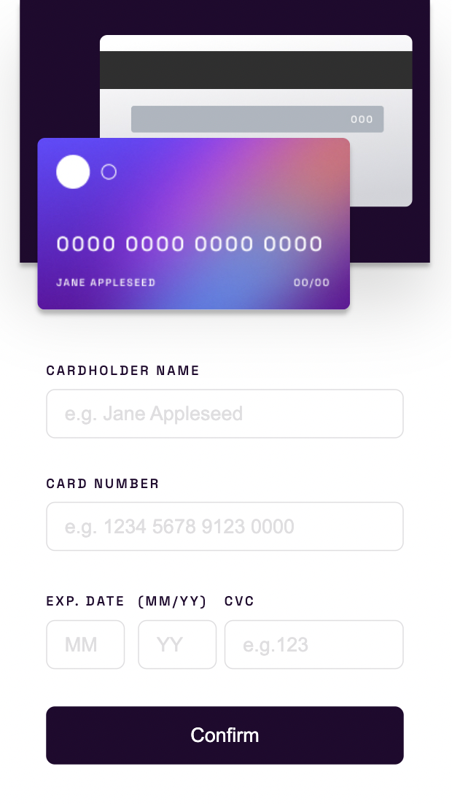
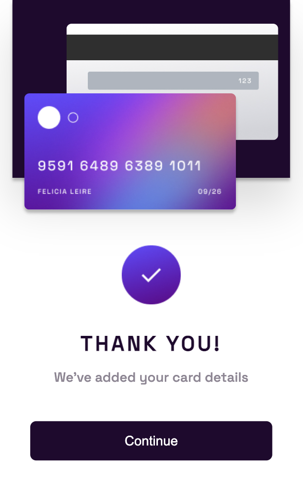
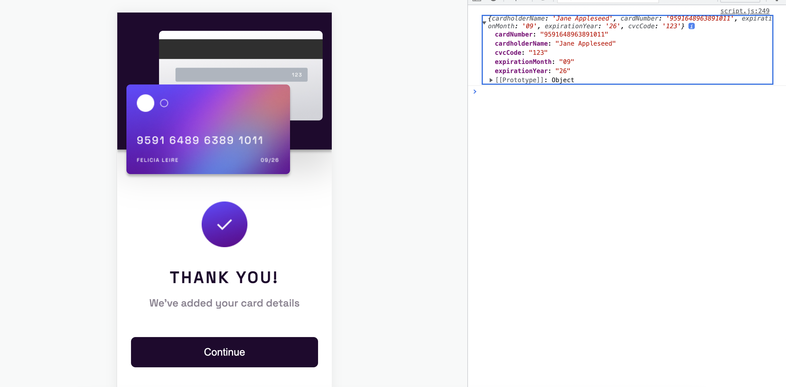
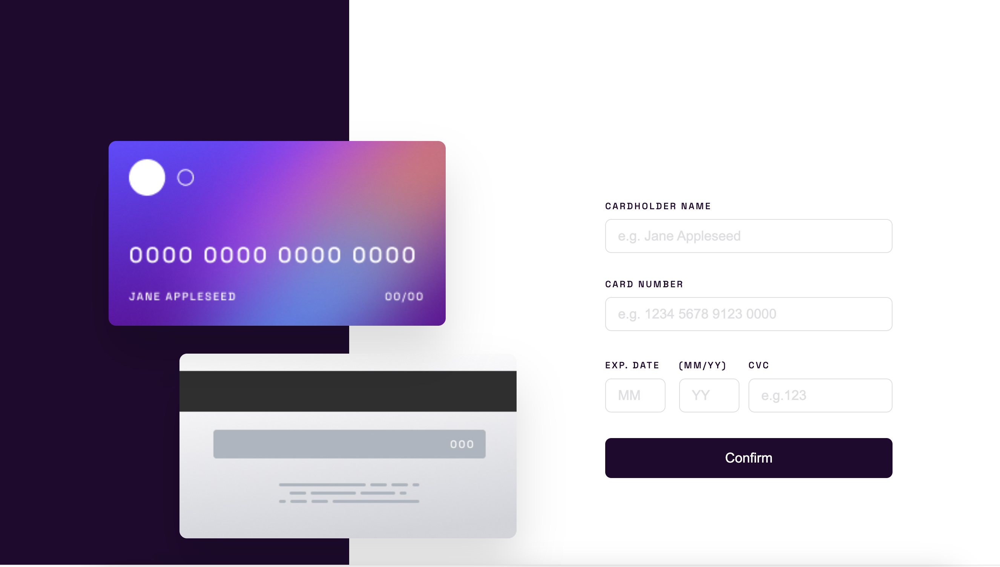
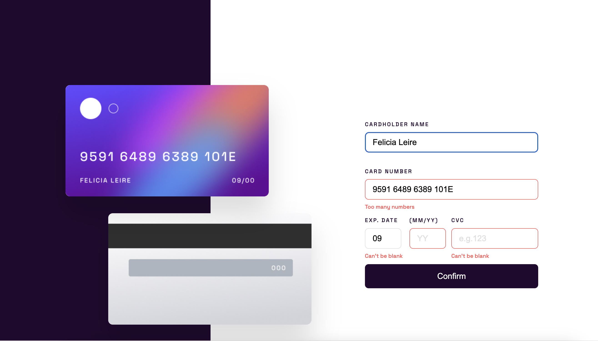
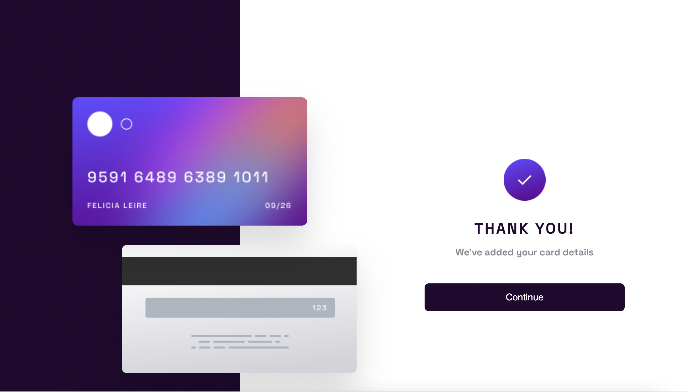

# Frontend Mentor - Interactive card details form

This is a solution to the [Interactive rating component challenge on Frontend Mentor](https://www.frontendmentor.io/challenges/interactive-card-details-form-XpS8cKZDWw/hub). Frontend Mentor challenges help you improve your coding skills by building realistic projects. 

## Table of contents

- [Overview](#overview)
  - [The challenge](#the-challenge)
  - [Screenshot](#screenshot)
  - [Links](#links)
- [My process](#my-process)
  - [Built with](#built-with)
  - [What I learned](#what-i-learned)
  - [Continued development](#continued-development)
  - [Useful resources](#useful-resources)
- [Author](#author)

## Overview
This component is a mobile responsive credit card component. The user has five input fields to enter their credit card information into. There are functions in place to verify the user information. These include empty fields, characters other than numbers, and number limitations.

### The challenge

Users should be able to:

- View the optimal layout for the app depending on their device's screen size
- See hover states for all interactive elements on the page
- Enter information that is verified and display error messages when incorrect
- See the "Thank you" card state after submitting the card information

### Screenshot








### Links

- Solution URL: [Add solution URL here](https://github.com/Stacy-Riley/interactive-card-details-form)
- Live Site URL: [Add live site URL here]()

## My process
I began with the mobile version and then moved on to creating the desktop version. After the app was styled, I added the JavaScript functions that verified the user data.

### Built with

- Semantic HTML5 markup
- CSS custom properties
- Flexbox
- Mobile-first workflow
- JavaScript


### What I learned
I like how all the functions runs with the submit button.  Also, I got to the end of the event listener and wanted to learned how to grab the data the form had taken in.  I was able to do that by creating an object named ccInfo and console.log the results.

```js
  //Click event to listen for the submit button:
confirmButton.addEventListener("submit", function(event){
    event.preventDefault();
    verifyName();
    verifyCardNumber();
    verifyMonth();
    verifyYear();
    verifyCvc();
    //Add checks for input fields
    if( verifyName() === true && 
        verifyCardNumber() === true && 
        verifyMonth() === true && 
        verifyYear() === true &&
        verifyCvc() === true){
        
        ccPage.style.display = "none";
        thankYouPage.style.display = "block";
     } 
    //Gather the data
    const ccInfo = {
        cardholderName: cardholderName.value,
        cardNumber: cardNum.value,
        expirationMonth: expMonth.value,
        expirationYear: expYear.value,
        cvcCode: cvcCode.value
      };
      
      //Displaying entered data here so you can see that the code works:
      console.log(ccInfo);
});
```

### Continued development

I'm all about getting better at collecting and organizing user data so I can help the website owner make things better for everyone. The goal is to give users a smoother experience and some valuable insights to the site owner.


### Useful resources

- [Example resource 1](https://www.captain-design.com/blog/how-to-export-images-in-figma/#:~:text=Export%20Frames%20to%20JPG,and%20hit%20the%20Export%20button.) - This helped me learn how to export images from figma designs.

## Author

- Website - [Stacy Riley](https://www.createdbystacy.com)
- Frontend Mentor - [@Stacy-Riley](https://www.frontendmentor.io/profile/Stacy-Riley)
- Twitter - [@askstacyriley](https://twitter.com/AskStacyRiley)

